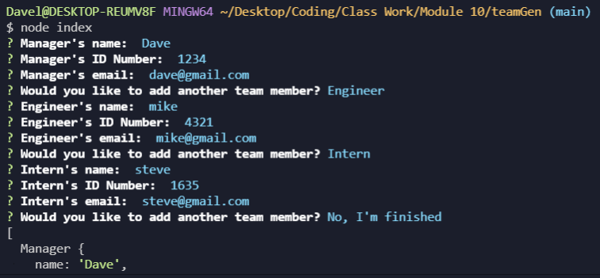

# teamGen

## About This Project

#### teamGen is a command line application that allows you to create employee profile cards with links to email, id number, and employee role.

## How it works:

#### Using the command line you are prompted with questions to create a manager profile and then prompted to create more employee profiles. The application continues as long as you select to create profiles otherwise you can terminate the application by choosing the complete option.

### Image of command line questions

## Motivation:

#### I wanted to create an application that allows individuals to easily create employee cards with links to their information.

## Challenges:

#### I struggled to find a way to write the user input into the HTML file as well as successfully write the HTML file